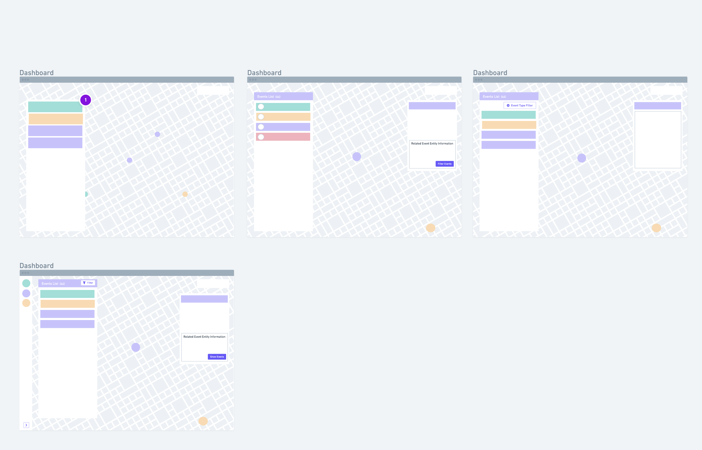

## Product Engineer (web) homework - Joe Oliver

#### Install Instructions

`=> npm install`
`=> npm run start`

#### Live Link

Live version deployed [here](https://productengineerhomework.joeyoliver.now.sh )

#### Super Quick Wireframes:

#### TODOS
- [x] Add style constants
- [x] Add app wide styles
- [ ] Add layout component
- [x] Create Data Types for event and stubs for other data types
- [x] Add enum for event types
- [ ] Add loading & error components
- [ ] Create Events Repository
- [x] Fetch event data
- [x] Add Mapbox Library
- [x] Add Map
- [x] Add LocationEvent List
- [x] Add markers to the map
- [x] Make markers and event list icons and colors correspond
- [ ] Center map to contain all the currently loaded events
- [ ] Add map event detail
- [ ] Add filter for the event type

#### Notes
I spent a bit longer on this than I intended, but enjoyed this challenge immensely.

I had several goals with how I went about the challenge:

#### Demonstrate my proficiency with your stack:
I used next.js, and react, as well as using Typescript with Font Awesome for the icons and Mapbox for the map. I deferred using any state management tool - although I know you use  redux - because it's just overkill for this.

#### Demonstrate my proficiency with modern javascript and design patterns
I use a lot of ES6 features and Typescript throughout the app and use this as an opportunity to demonstrate some of the design patterns that I like, even though they were a bit of a time sink.
For example, in the models directory I use the Builder design pattern to construct instances of the Event class. The builder checks the incoming API, 
converts the JSONified fields into their correct data type, and passes the correct fields into the Event constructor.
While a lot more boilerplate code, I think this is very testable, clean and allows you to make your data layer rock-solid. I also wanted 
to use the Repository pattern for the API calls, but, alas, this will have to wait for another day ...

#### Demonstrate my advanced knowledge of using Mapbox and map design 
I didn't use a Deck.gl layer over this map, just native Mapbox. I load the events directly to the native Mapbox engine instead of 
using the marker api as this just creates DOM elements on top of the map and translates them as you move it which is much less performant. 
The color of the markers corresponds to the colors of the events in the list. Adding the same icons to the map markers would have been simple, 
but is a time sink so I avoided it. While this is not a fancy visualisation, I wanted to demonstrate that I can design and create production-level
maps within a limited time scope.

#### Next Steps
Finally, I wanted to implement an event detail view in which you would be able to view the details of the event and the related entities 
(users, geofences, places) and then apply filters the event list and the map based on selected entities - for example filtering all events relating to 
a certain geofence. While this would have been fun and given this project some extra color, this would have taken me over 'several hours' of work and I didn't want to 
be disingenuous and present it as such.

I hope you feel that, while not the fanciest of visualisations, this is a well designed, performant application in which I demonstrate conscientious 
design and engineering skills within a limited time frame.

Cheers,
Joe

        

   
